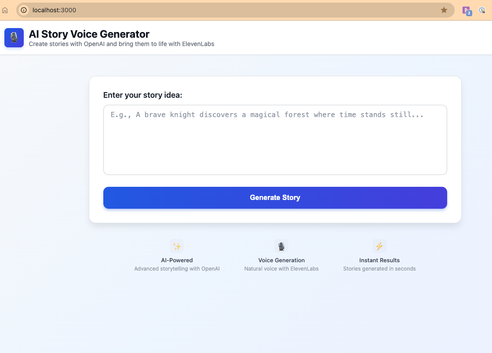
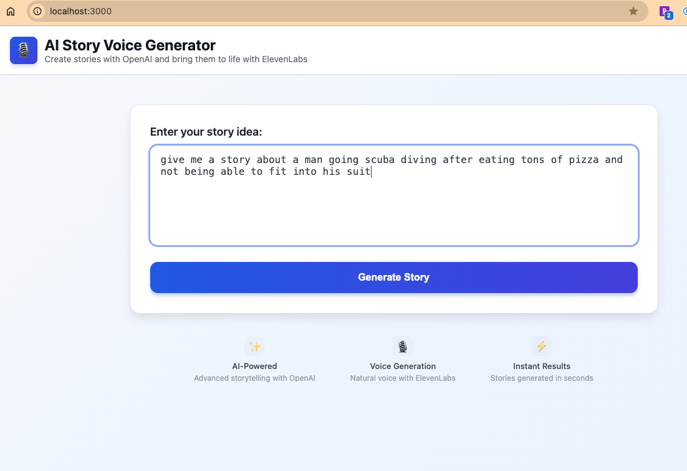
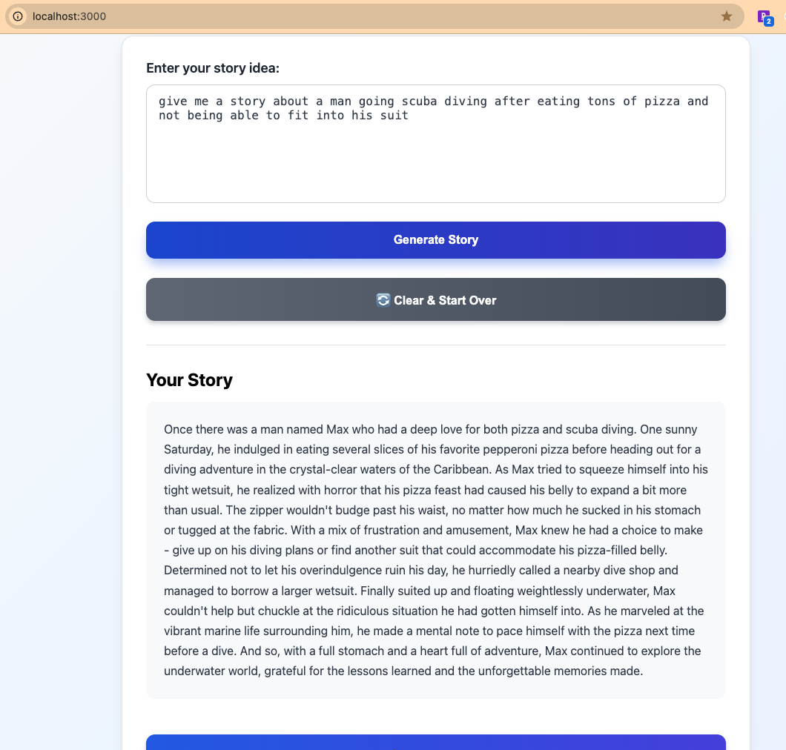
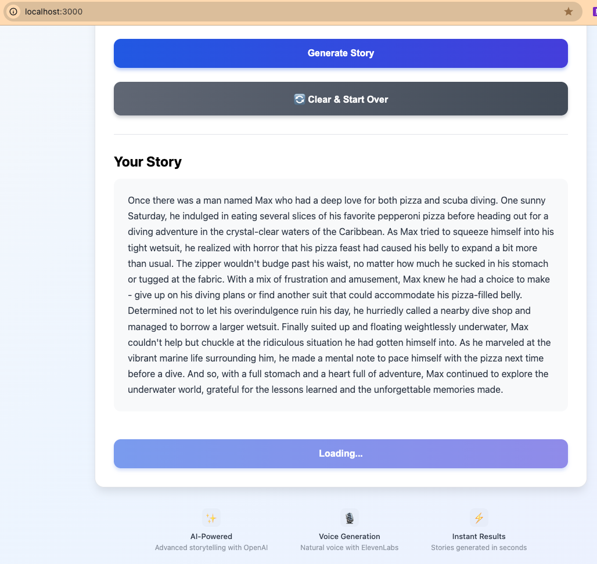
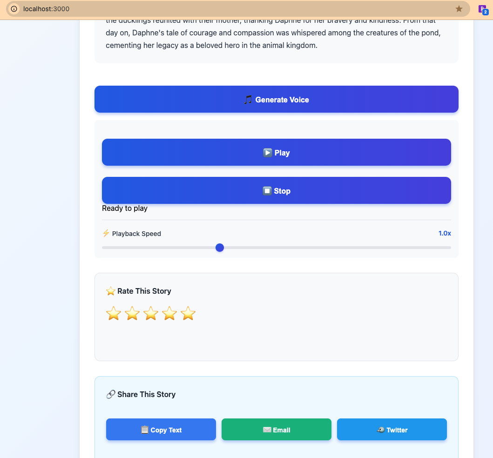
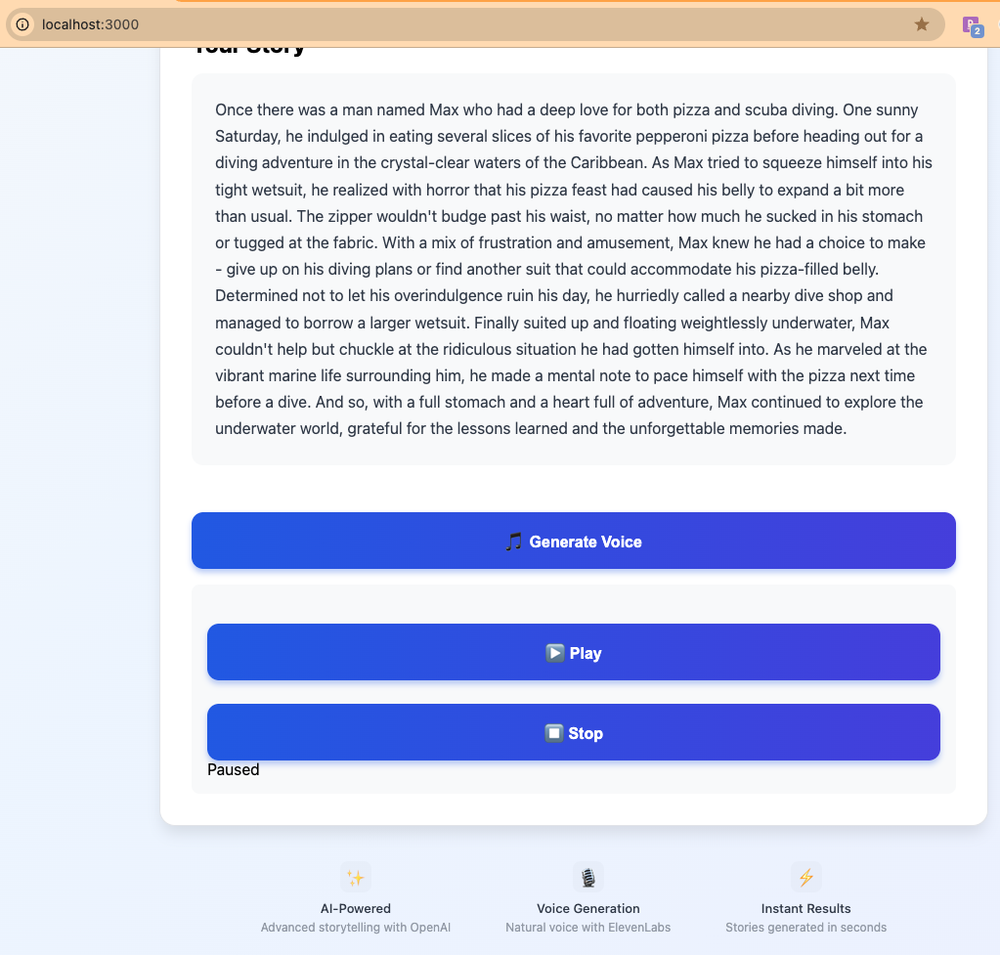
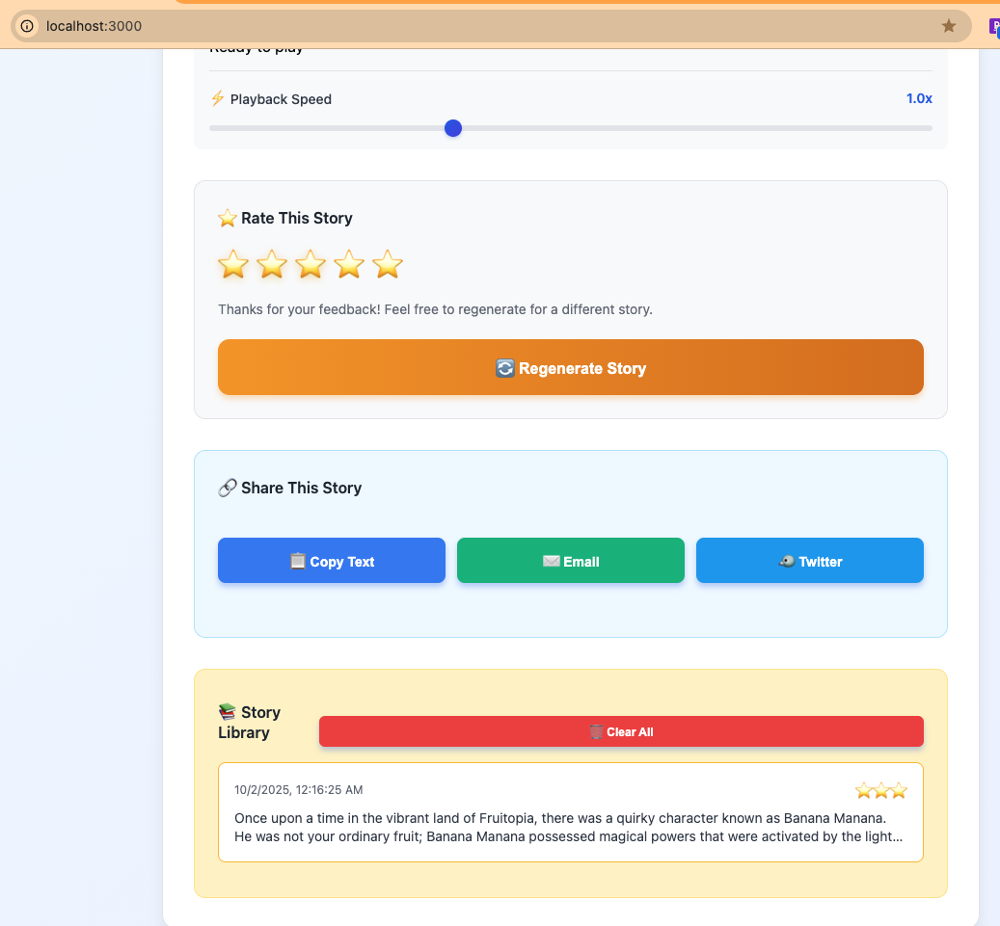
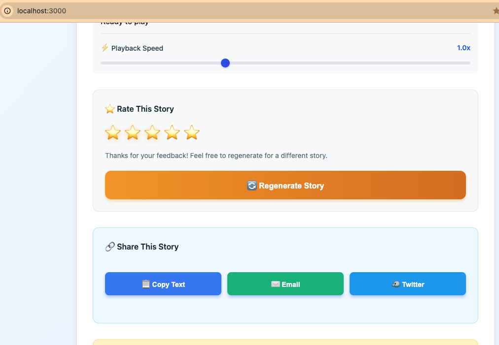
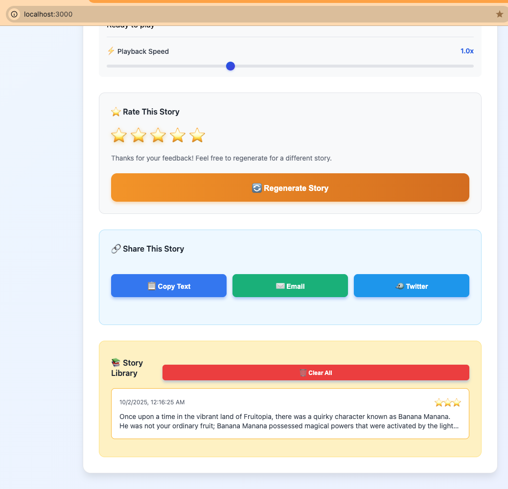

# AI Story Voice Generator

A voice-powered story application that uses OpenAI to generate creative short stories and ElevenLabs to narrate them with realistic AI voices.

## Screenshots

### Landing Page


### Entering a Story Prompt


### Generated Story


### Generating Voice


### Audio Controls with Playback Speed


### Paused Playback


### Story Rating & Regeneration


### Share Functionality


### Story Library/History


## APIs Used

### OpenAI API
- **Purpose**: Generate creative short stories based on user prompts
- **Model**: GPT-3.5 Turbo
- **Functionality**: Takes a story idea as input and creates a complete narrative (200-300 words)

### ElevenLabs API
- **Purpose**: Convert generated text stories into natural-sounding speech
- **Model**: Eleven Monolingual v1
- **Functionality**: Text-to-speech synthesis with realistic voice narration

## Features

- 📝 Generate creative short stories using OpenAI GPT-3.5
- 🎙️ Convert stories to speech using ElevenLabs text-to-speech
- ▶️ Play/Stop audio controls
- ⚡ Adjustable playback speed (0.5x - 2.0x)
- ⭐ Story rating system with regeneration option
- 🔗 Share stories via copy, email, or Twitter
- 📚 Story library with automatic saving and timestamps
- 🔄 Clear & Start Over functionality
- 🎨 Beautiful, modern UI with responsive design

## Prerequisites

- Node.js (v14 or higher)
- npm
- OpenAI API key
- ElevenLabs API key

## Installation

1. Clone the repository:
```bash
git clone <your-repo-url>
cd Eleven
```

2. Install dependencies:
```bash
npm install
```

3. Create a `.env` file in the root directory:
```bash
cp .env.example .env
```

4. Add your API keys to the `.env` file:
```
ELEVENLABS_API_KEY=your_elevenlabs_api_key_here
OPENAI_API_KEY=your_openai_api_key_here
```

**Getting API Keys:**
- **OpenAI**: Get your API key from [OpenAI Platform](https://platform.openai.com/api-keys)
- **ElevenLabs**: Get your API key from [ElevenLabs](https://elevenlabs.io/) (Profile → API Keys)

## Usage

1. Start the server:
```bash
npm start
```

2. Open your browser and navigate to:
```
http://localhost:3000
```

3. **Generate a Story**
   - Enter a story idea in the text box
   - Click "Generate Story"
   - Wait for OpenAI to create your story

4. **Generate Voice Narration**
   - Click "Generate Voice" to convert the story to speech
   - Wait for ElevenLabs to create the audio

5. **Control Playback**
   - Click "▶️ Play" to start the narration
   - Click "⏹️ Stop" to stop and reset playback
   - Use the **Playback Speed** slider to adjust narration speed:
     - Range: 0.5x (slower) to 2.0x (faster)
     - Default: 1.0x (normal speed)
     - Adjust in real-time while audio is playing

6. **Rate the Story**
   - Click on the stars (⭐) to rate the story from 1 to 5
   - Receive contextual feedback based on your rating:
     - 1-2 stars: Option to regenerate appears
     - 3 stars: Neutral feedback with regenerate option
     - 4-5 stars: Positive feedback
   - Click **"🔄 Regenerate Story"** if unsatisfied to create a new story with the same prompt
   - Rating resets automatically when regenerating

7. **Share Your Story**
   - **📋 Copy Text**: Copy the story to your clipboard
   - **✉️ Email**: Share via email client
   - **🐦 Twitter**: Share on Twitter (opens in new window)
   - Confirmation messages appear after each action

8. **Story Library**
   - All generated stories are automatically saved with timestamps
   - View up to 10 most recent stories
   - Click any saved story to reload it
   - Stories display their ratings (⭐)
   - **🗑️ Clear All**: Remove all saved stories (with confirmation)
   - Stories persist across browser sessions using localStorage

9. **Start Over**
   - Click "🔄 Clear & Start Over" to reset everything and create a completely new story

## Tech Stack

- **Backend**: Node.js, Express
- **AI Services**: OpenAI GPT-3.5, ElevenLabs TTS
- **Frontend**: Vanilla JavaScript, HTML5, CSS3

## API Endpoints

- `POST /api/generate-story` - Generate a story from an idea
- `POST /api/generate-audio` - Convert text to speech

## Security

Make sure to:
- Never commit your `.env` file
- Keep your API keys secure
- Add `.env` to `.gitignore` (already included)
